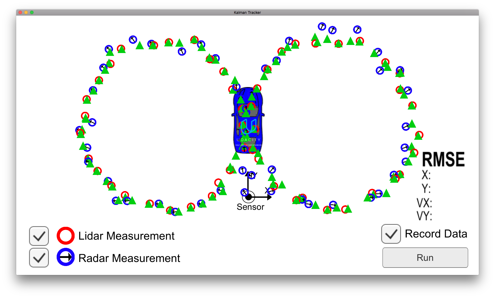

# Extended Kalman Filter for object tracking

This code implements an Extended Kalman Filter to track the motion of an
object based on noisy radar and lidar measurements.

Sample output visualisation:

